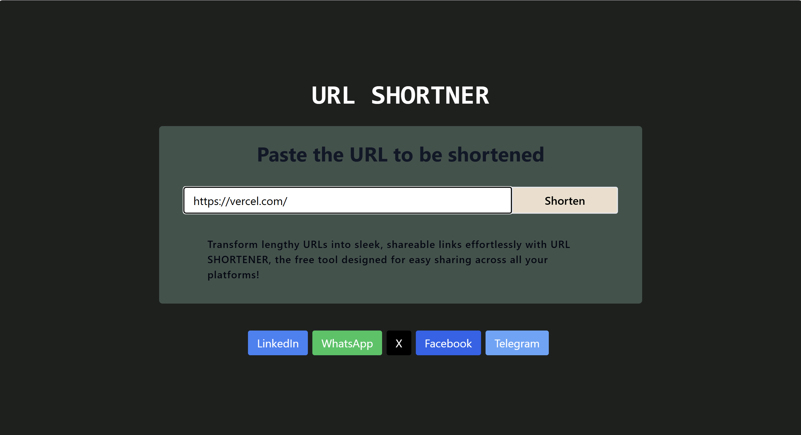
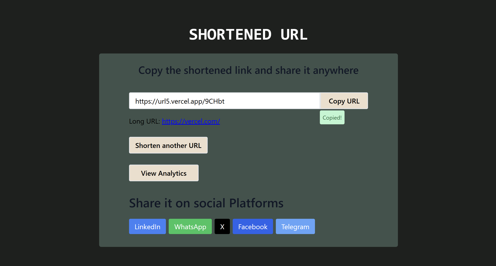
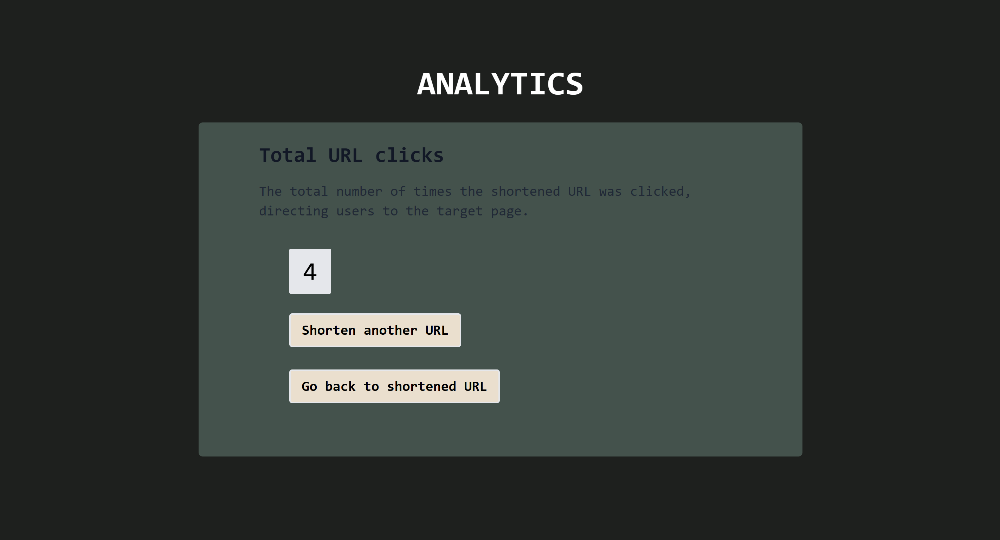

# URL Shortener

A MERN stack-based URL shortener that converts long URLs into short, shareable links for easy sharing across platforms.

## Features

- **URL Shortening**: Input a long URL and instantly generate a shorter version.
- **Copy Link**: Easily copy the shortened URL to your clipboard with a single click.
- **Social Sharing**: Share the shortened link directly to popular social platforms like LinkedIn, WhatsApp, X (formerly Twitter), and more.
- **Analytics**: (Optional) Track the number of clicks and other analytics for each shortened URL.

## Tech Stack

<div align="center">

&nbsp;
&nbsp;
&nbsp;
&nbsp;

</div>


## Installation Instructions

1. Clone the repository:

   ```bash
   git clone https://github.com/vedansh2001/URL_Shortner.git
2. Navigate to the backend folder:

   ```bash
   cd backend
3. Install the dependencies:

   ```bash
   npm install
4. Start the backend server:

   ```bash
   npm run dev
5. Now, navigate to the frontend folder:
   ```bash
   cd ../frontend   
6. Install the dependencies for the frontend:

   ```bash
   npm install

7. Start the frontend server:

   ```bash
   npm run dev
   
## Usage
Once both the backend and frontend servers are running, open your browser and go to:

   ```bash
   http://localhost:5173
   ```
Enter a long URL in the input field, click the Shorten URL button, and your shortened URL will be generated. You can then copy the shortened URL using the Copy URL button and share it on social platforms.

## Screenshots




## Live Demo
Live Deployed URL

```bash
https://urlshortners.vercel.app/
```
